# [Intel] Edge AI SW Academy (2023-07-04 ~ 2024-01-30)

공부한 내용을 공유하기 위한 원격 저장소입니다.

## GitHub를 써야하는 이유

- 인터넷만 된다면 언제 어디서나 코드와 자료들을 공유할 수 있습니다.

### 용어 정리

원격 저장소 == 리모트 저장소 == remote repository
지역 저장소 == 로컬 저장소   == local reprository

## 목차

- 1. 설치와 세팅
- 2. 내 코드를 깃헙에 올려보자!
- 3. 기타 사용법

### 1. 설치와 세팅

#### Git 설치 파일 다운로드

1. <a href = "https://git-scm.com" target = "_blank">Git 홈페이지</a>에 들어갑니다.
2. 화면 우측 중앙에 나오는 모니터의 'Download for Windows' 버튼을 클릭합니다.
3. 제목(Download for Windows) 바로 아래에 있는 'Click here to download' 링크를 클릭합니다.

#### Git 설치

- 아래에 보이는 두 사진의 옵션을 제외하고는  
모두 Next로 넘어간 뒤 Install로 설치 진행해주세요.  

   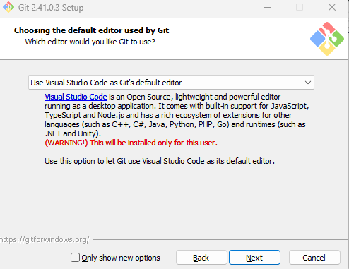

   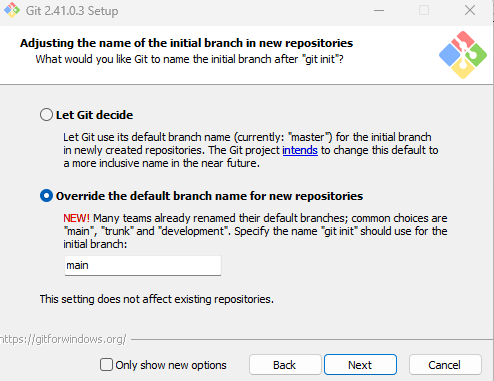

- 설치가 완료되셨다면 'View Release Notes'를 체크 해제하시고 Finish 누르시면 됩니다.  
- 만약 Visual Studio Code가 켜져 있는 상태라면 Git을 인식할 수 있도록 껐다가 다시 켜주세요.

#### GitHub 계정 만들기

1. <a href = "https://github.com" target = "_blank">GitHub 홈페이지</a>에 들어갑니다.
2. 오른쪽 위의 'Sign Up' 버튼을 클릭합니다.
3. email(이메일), password(비밀번호), username(사용자 이름)을 차례로 입력합니다.
4. GitHub 공지사항을 이메일로 받고 싶다면 'y', 아니라면 'n'을 입력합니다.
5. 퍼즐을 풀고 'Create Account' 버튼을 클릭합니다.
6. 입력한 이메일로 온 코드를 입력하세요. 완료되면 창을 닫아도 좋습니다.

#### 원격 저장소를 지역 저장소로 복제해오기

1. <a href = "https://coding-factory.tistory.com/940" target = "_blank">이 게시글</a>의 1~7 과정을 따라합니다.
2. 'Intela_studyroom'을 입력해서 'HardCoding0417/intela_studyroom' 항목을 찾아 Enter를 누릅니다.
3. 지역 저장소 폴더를 만들 위치를 지정해줍니다. 보통 'C:\\Users\\`계정명`\\'에 저장합니다.
4. 'Open' 버튼을 눌러 현재 창에서, 혹은 'Open in New Window' 버튼을 눌러 새 창에서 지역 저장소 폴더를 엽니다.
5. 'Do you trust the authors of the files in this folder?' 팝업이 뜨면 'Yes, I trust the authors' 버튼을 누릅니다.

#### 사용자 이름과 이메일 입력하기

<code>Ctrl + \`</code>로 터미널 창을 열어서 다음 두 명령어를 입력합니다.  

```
git config --global user.name "사용자 이름"  
git config --global user.email "이메일 주소"
```

버전을 관리할 때 같이 기록되는 정보들입니다.  
정보를 입력하지 않으면 버전 관리를 할 수 없으니 꼭 입력해주세요.

#### 내 branch 만들기

1. 원격 저장소를 복제해오면서 만든 'intela_studyroom' 지역 저장소 폴더가 Visual Studio Code에서 열려있는 상태입니다.
2. `Ctrl + Shift + G` 혹은 왼쪽의 아이콘들 중 세번째 아이콘을 클릭합니다.

    
3. 아래 사진과 같이 'Create Branch...'를 찾아 클릭합니다.

    
4. 붙임표(-)나 밑줄(_)을 이용해서 자신의 영어 이름을 입력합니다.  
    예시) Hong-Gildong
5. 왼쪽 아래에 해당 이름으로 branch가 변경됨을 확인할 수 있습니다.  
앞으로는 기존의 'main' branch가 아닌 자신이 새로 만든 브랜치에서 작업하면 됩니다.

여기까지 마치셨다면 깃과 깃허브를 사용할 준비가 끝난 것입니다.

이제 사용 순서를 알아보겠습니다.

---

### 2. 내 코드를 깃헙에 올려보자!

따라하면서 배울 수 있도록 구성했습니다.

#### 2-1 커밋하기

먼저, 로컬 저장소에서 코드를 변경합니다.

    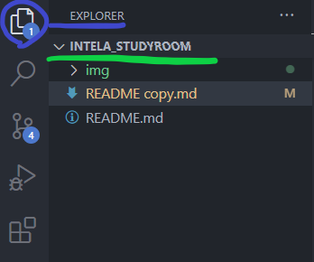

파란색 동그라미로 표시된 Explorer를 클릭하면  
초록색 선으로 줄쳐진 INTELA_STUDYROOM 폴더가 보일 겁니다.  
이 폴더가 여러분의 로컬 저장소local repository입니다.  

아무 코드나 업로드해보세요. 사진 같은 걸 올리셔도 좋습니다.  

2. 로컬 저장소에서 코드를 변경하면 소스 컨트롤 버튼에 알람이 들어옵니다.

    

3. 소스 컨트롤을 클릭해보시고, 아래 사진과 같이 'Changes' 옆의 플러스(+) 아이콘을 찾아 클릭해줍니다.

    

+버튼을 누르면 변경사항(Changes)에 있던 소스파일이  
아래 사진과 같이 Staged Change 탭으로 이동한 것을 확인할 수 있습니다.
    
    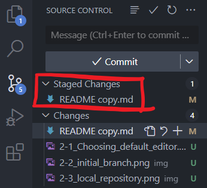

여기까지의 작업을 스테이징이라고 합니다.  

4. 스테이징이란 커밋을 준비하는 단계로,

    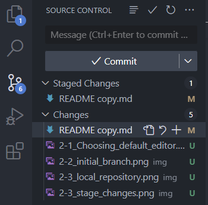

1번에 메세지를 입력 후  
2번의 커밋 버튼을 클릭하면  

스테이징된 변경사항들이 저장소에 기록됩니다. (스테이징되지 않은 변경사항들은 기록되지 않습니다)  
이처럼 스테이징된 변경사항들을 기록하는 행위를 커밋이라고 합니다.
    
5. 여기까지만 하면 로컬 저장소에만 커밋된 거라 남들이 볼 수가 없으니까  
push를 해서 원격 저장소에도 올려줘야 합니다.

소스컨트롤의 Sync Changes 버튼도 클릭해주면  
VScode가 알아서 push도 해주고 pull(원격 저장소의 내용을 가져오기)도 해줍니다

#### 2-2 커밋 내역 확인하기

커밋이 됐다는 게 무슨 의미인지 확인해봅시다.  

1. 아래의 사진에 보이는 곳을 클릭하면, 자신이 만든 브런치의 이름이 뜹니다.

    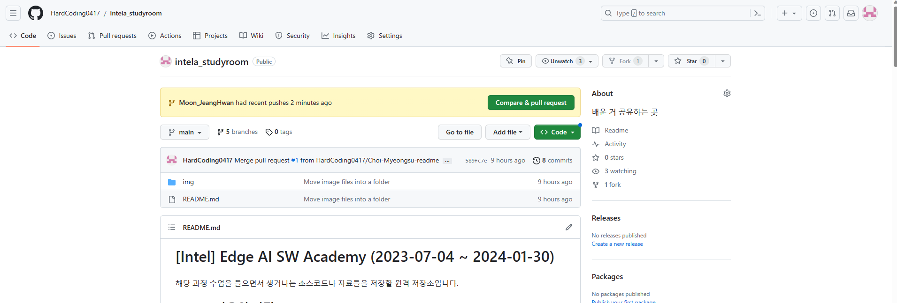

2. commits 버튼을 클릭해보세요.

    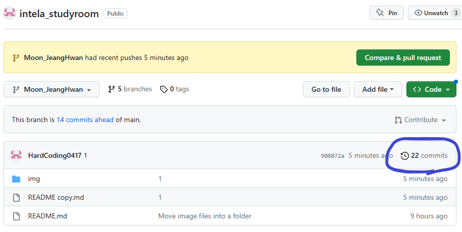

3. 아래에 보이는 것들이 커밋 내역들입니다. 왼쪽에 있는 40dd38c를 클릭해보면...

    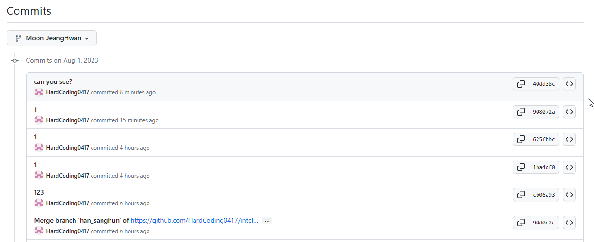

4. 추가된 부분은 +부호와 함께 초록색으로, 제거된 부분은 -부호와 함께 빨간색으로 표시됩니다.

    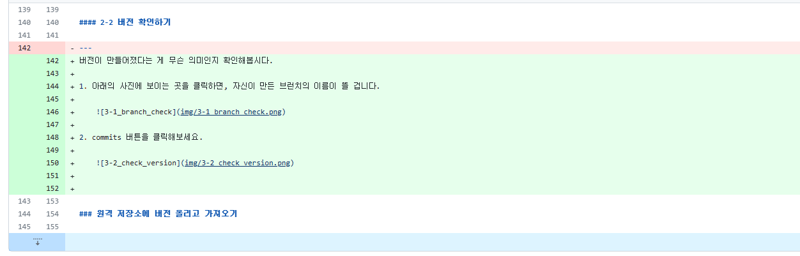

    이를 통해 무엇이 변경됐는지, 무엇이 추가됐는지 쉽게 알 수 있습니다.

#### 2-3 main에 머지하기

두 브랜치를 합치는 걸 머지merge라고 합니다 (일반적으로 내 브랜치를 main브랜치에 올리는 걸 의미합니다)

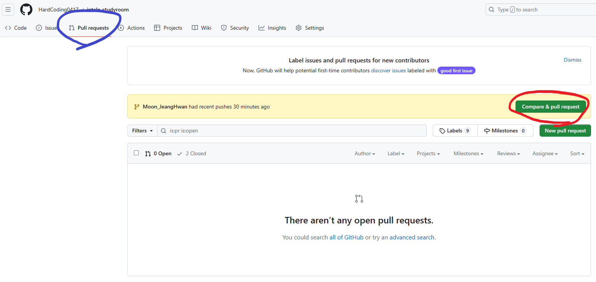

1. 파란색으로 칠해진 Pull requests 부분을 클릭합니다.

2. 빨간색으로 칠해진 compare & pull requests 부분을 클릭합니다.

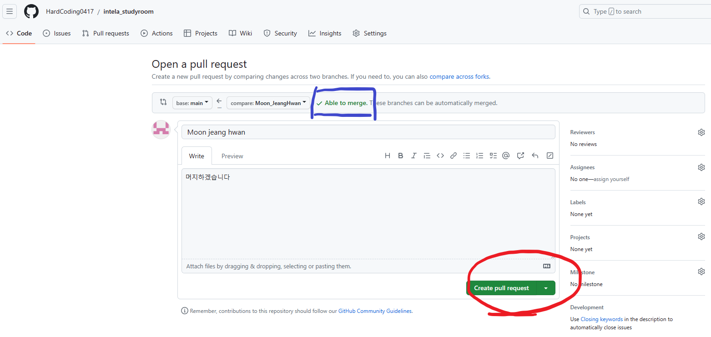

3. Able to merge. 머지해도 이상 없음이 떴다면 Creat pull request를 클릭합니다.

4. 여러분이 할 일은 끝났습니다.
이제 main 브랜치에 대한 권한을 가진 사람(반장)이
해당 머지 요청을 받아들이면 머지가 실행됩니다.

5. 머지가 실행되면 여러분의 브랜치에만 있는 파일이나 폴더가 있을 시  
해당 파일과 폴더가 main에 추가되고  
main에도 있는 파일인데 내용물이 조금 다르다면, 여러분의 파일이 main의 파일을 대체하게 됩니다.

### 주의사항!


1. 여러 사람이 쓰는 레포지토리이기 때문에,  
머지하실 때는 위 사진에 보이는 것처럼 한 곳에 폴더를 몰아넣으신 뒤 머지하셔야 합니다.

### 기타 사용법

1. 만약, 원격 저장소나 특정 브랜치를 로컬 저장소로 불러오고 싶으시다면  
아래 사진과 같이 'Pull from...'을 찾아 클릭합니다.

    
    'origin/`자신이 만든 branch 이름`'을 선택합니다.

---

### 다른 컴퓨터에서의 원격 저장소 접근

집이나 기숙사에 가서 원격 저장소에 올려진 버전을 다운받아 수정하고 다시 버전을 만들어 업로드 하고 싶다면 다음의 순서를 다시 따릅니다.

```
- Git 설치 파일 다운로드
- Git 설치
- 원격 저장소를 지역 저장소로 복제해오기
- 사용자 이름과 이메일 입력하기
- 내 branch 만들기
- pull / 원격 저장소의 변경사항을 지역 저장소에 적용
- 지역 저장소에서 간단하게 버전 관리하기
- push / 원격 저장소에 새로 만든 버전 적용하기
```
